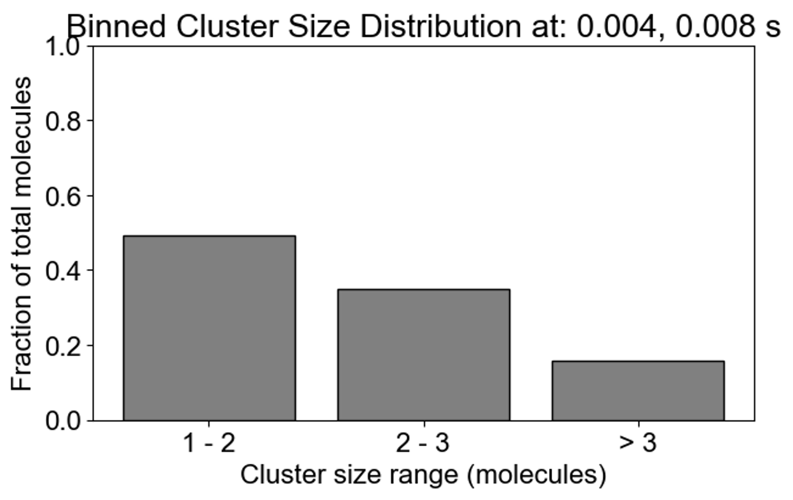
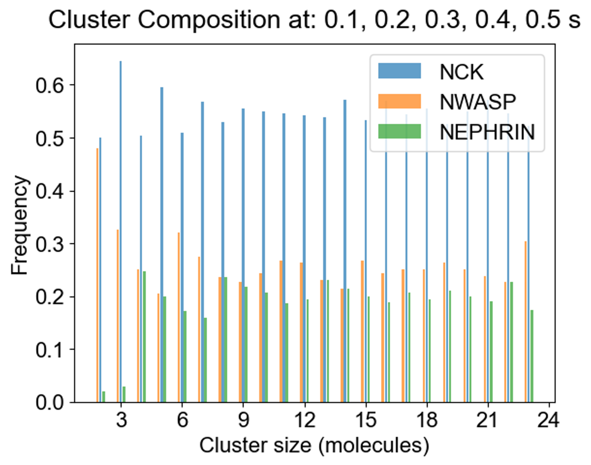
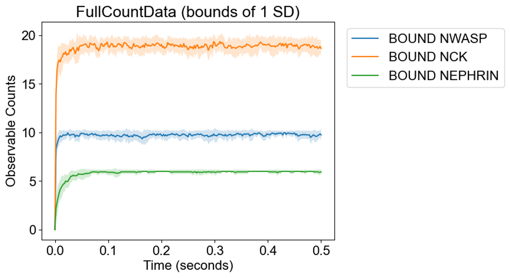
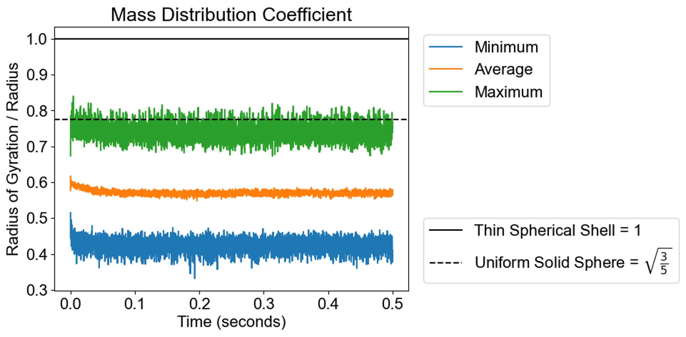
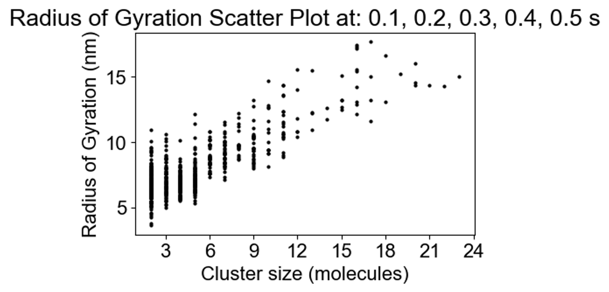
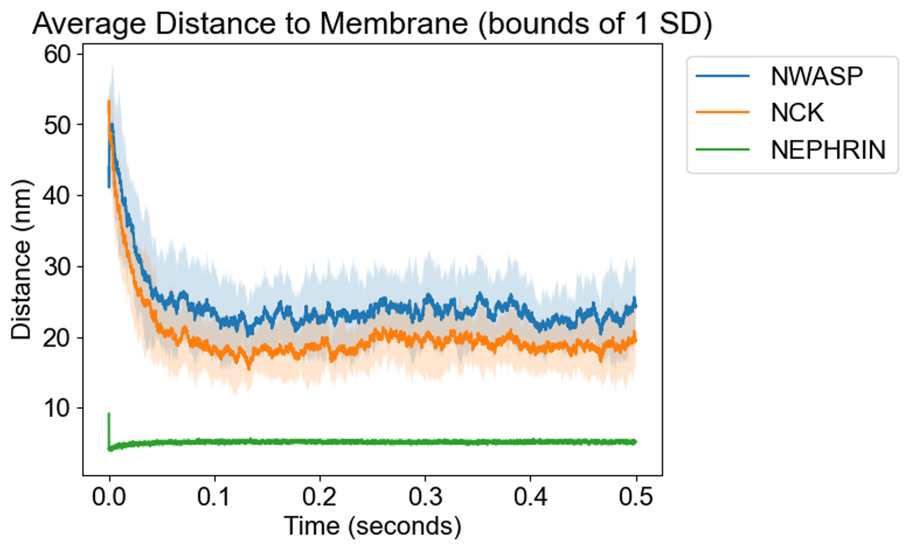
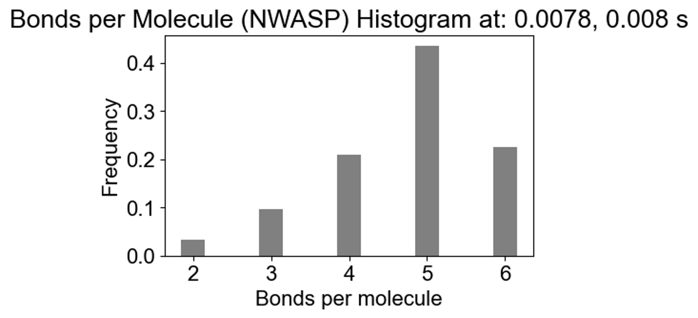
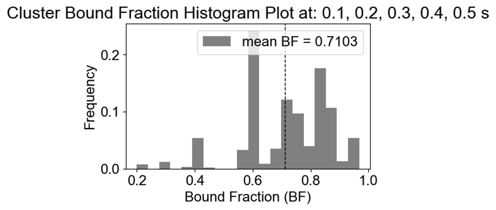
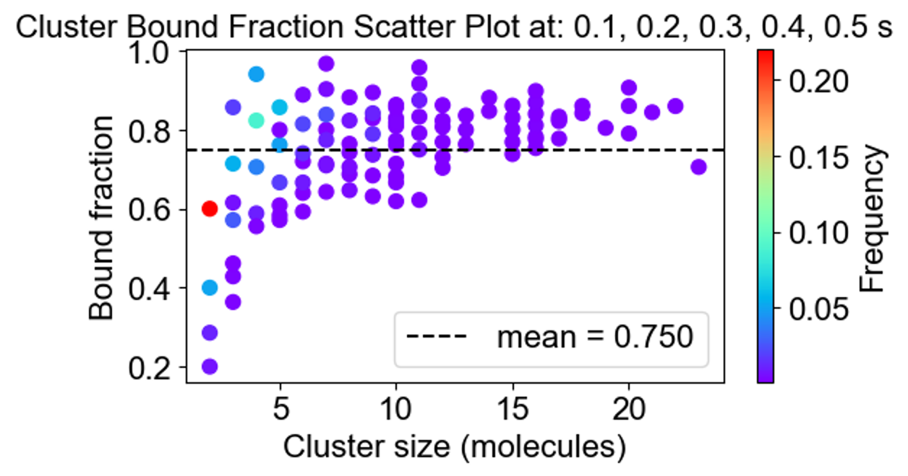

# SpringSaLaDpy

## Python package to run SpringSaLaD, analyze and vizualize its output 

**SpringSaLaDpy** is a lightweight command line interface (CLI) for [SpringSaLaD](springsalad). **SpringSaLaDpy** comes with 
- a command line entry point to edit and run SpringSaLaD, and 
- a library of useful functions for the analysis and visualization of SpringSaLaD outputs.

The original [SpringSaLaD](http://vcell.org/ssalad) is GUI application that requires installation and generates mostly raw data, without visualization and with limited analysis capabilities. **SpringSaLaDpy** adds 
* powerful **analysis and visualization** capabilities,
* a capability to modify and run existing SpringSaLa models without the need to invoke GUI - a useful capability for server-based simulations when launching GUI can be difficult.

## Workflow

The user selects a SpringSaLaD input file, usually generated with SpringSaLaD GUI. This file can be simulated through SpringSaLaDpy or the SpringSaLaD GUI. Both methods will produce the same simulation results.  SpringSaLaDpy helps to understand and visualize the input file and allows updating initial counts and kinetic rates. In either case, the simulations output a folder of results containing CSV and text data files describing the state of the simulation at each point in time.  

From here, the user will pick an analysis function and select arguments for data to analyze (e.g. specific time point during the simulation) and outputs to display (e.g., an argument could be a range over which to display a distribution of cluster sizes). The simulation data are processed and outputs are put into the pyStat folder. Lastly, SpringSaLaDPy uses these pyStat files to make the visualization and display it for the user.

## SpringSaLaDpy input: model specification in SpringSaLaD format

The [model specifications](https://raw.githubusercontent.com/SpringSaLaDpy/SpringSaLaDpy_demo/refs/heads/main/GUI_results/Nephrin-Nck-NWasp/Final_version_test_SIMULATIONS/Simulation0_SIM.txt) generated by SpringSaLaD GUI.

## SpringSaLaDpy outputs

### Describing and visualizing of molecular clusters

[analysis.ipynb](https://github.com/SpringSaLaDpy/SpringSaLaDpy_demo/blob/main/analysis.ipynb) 
provides human-readable description and visualization of the [model specification](https://raw.githubusercontent.com/SpringSaLaDpy/SpringSaLaDpy_demo/refs/heads/main/GUI_results/Nephrin-Nck-NWasp/Final_version_test_SIMULATIONS/Simulation0_SIM.txt) generated by SpringSaLaD GUI without the need to invoke GUI:

If the model was previously simulated, SpringSaLaDpy provides customizable screenshots of cluster distribution at requested timepoints:

### Cluster composition at specific timepoints
  
SpringSaLaDpy can process simulation results and plot cluster distribution at specific time point(s). The first plot shows the fraction of total molecules in the clusters of different sizes: one can see that 14% of all molecules are in clusters of size 4, while the next most popular cluster size 5 accumulates 12%. Note the dashed vertical line - it is the mean of the distribution, callesd **average cluster occupancy**. The next plot demonstrated the fraction of molecules in monomers and dimers (1-2 molecules), small clusters (2-3 molecules), and relatively large (more than 3 molecules) clusters.
<table>
  <tr>
    <td></td>
    <td></td>
  </tr>
 </table>

### Cluster properties of specific molecules

 The next plot demonstrates the cluster composition - distribution of Nck, Nephrin and NWasp in clusters of different size. One can zoom in on specific clusters. 
<table>
  <tr>
    <td></td>
    <td></td>
  </tr>
 </table>

### Timecourses for cluster properties 
  
SpringSaLaDpy can process simulation results and plot time plots of:
- quantities of bound and unbound molecules and molecular sites in specific states, within one standard deviation
- average clusters size (total number of molecules divided by the total number of molecular complexes)
- average cluster occupancy (mean of cluster distribution).
<table>
  <tr>
    <td></td>
    <td></td>
    <td></td>
  </tr>
 </table>

### Change of spatial properties of clusters over time
SpringSaLaDpy computes and plots 
- the radius of gyration (a key parameter that describes the spatial conformation of a molecular cluster, computed as a root mean square distance of all sites to its center of mass).
- Cluster size (the number of constituent molecules in a given cluster, at each time point maximal, minimum and average number of molecules in all clusters is plotted)
- Cluster radius (the maximum distance between a site and its cluster’s center of mass).
- Variations in mass coefficients defining distribution of mass, computed as a radius of gyration / maximum radius for a given cluster. For comparison, mass coefficient of a thin spherical shell (where all
  mass is at the periphery) is close to 1, mass coefficient for a solid sphere is square root of 3/5, and if all mass is concentrated in the center then the mass coefficient is 0). One can see that some clusters (in green) demonstrate properties of a solid sphere, while majority of clusters have more mass towards its center.
  - Radius of gyration of various clusters, depending on the size of the clusters. One can see that for larger clusters radius of gyration is becoming linearly larger.
  - Average distance of center of mass of identical molecules to the membrane. One can see that Nephrin is bound to the membrane and stays close to it. Meanwhile, as Nck and NWasp are recruited by Nephrin, their center of mass is becoming closer to the membrane.

<table>
  <tr>
    <td></td>
    <td></td>
  </tr>
    <tr>
    <td></td>    
    <td></td>
  </tr>
      <tr>
    <td></td>  
    <td></td>    
  </tr>
 </table>
 
### Cluster properties - bonds saturation

SpringSaLaDpy will analyze and plot the frequency of molecules in clusters with a given number of bonds.
- The histogram demonstrates the fraction of NWASP moledules that have a certain number of sites being bound. One can see that 45% of all NWASP molecules have 5 bonds, while 22% of MWASP are fully saturated (6 out of 6 sites are bound).
- The middle plot demonstrate the bound fraction (bound sites / free sites) of sites bound in clusters of all sizes. One can see that most frequently (25%) clusters have 60% of sites being bound, with no clusters having all sites bound, and only 5% of clusters being almost saturated with 90% of sites being bound.
- The plot on the right is a scatter plot, where each point is a set of clusters of a given size and bound fraction. The color of each point corresponds to the frequency of this cluster type. One can see that the most frequent cluster 

Histogram demonstrates that almost 48% of all molecules have very weak connectivity (one bond), while there are few molecules that serve as hubs with 3, 4, 5 or even 6 (there are NWasp molecules) bonds. An average molecule has 1.75 bonds. On the right the same cluster distribution is plotted as bound fraction of molecules per cluster size. One can see that large clusters tend to be unique (red dots) while small clusters come in a variety of compositions. What is more important, the bound fraction converges to a fixed value for larger clusters, meansing binding sites are saturated up to 42% maximum.
<table>
  <tr>
   <td></td>
    <td></td>
    <td></td>
  </tr>
 </table>
 

### Data storage for post-processing
 
All the simulation outputs are written to the folder .... The statistical data generated by SpringSaLaDpy and used to plot figures is stored in pyStat folder within the model folder.
