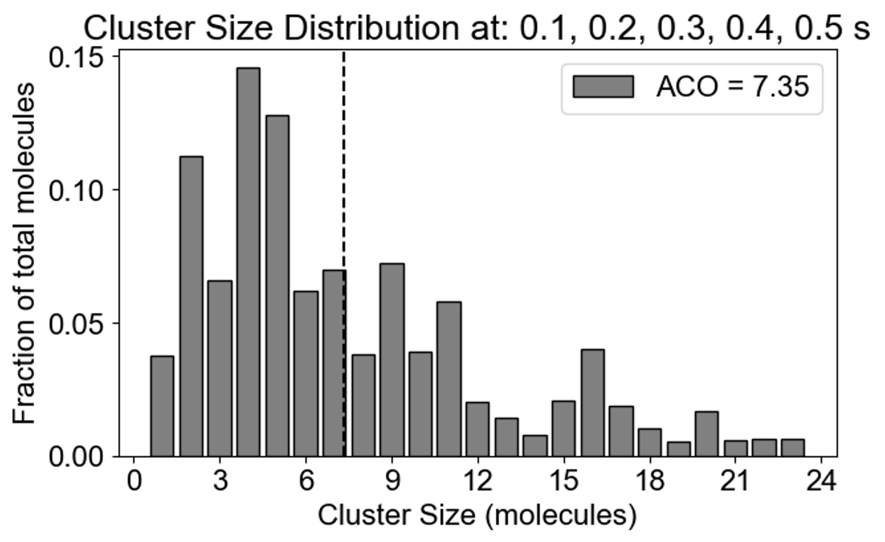

# SpringSaLaDpy

## Python package to run SpringSaLaD, analyze and vizualize its output 

**SaLaDpy** is a lightweight command line interface (CLI) for [SpringSaLaD](https://www.ncbi.nlm.nih.gov/pubmed/26840718). **SpringSaLaDpy** comes with 
- a command line entry point to edit and run SpringSald, and 
- a library of useful functions for the analysis and visualization of SpringSaLaD outputs.

The [SpringSaLaD](https://www.ncbi.nlm.nih.gov/pubmed/26840718) is GUI application that 
- a particle-based, spatial stochastic simulator for molecules in 3D
- molecules presented as a collection of impenetrable spheres (called “sites”) in 3D linked by stiff springs.

- The sites represent protein binding domains, such as an SH2 domain or a catalytic domain,
- each site can be associated with a number of biochemical states, such as “active” or “inactive” for a catalytic domain.
- each site has a separate diffusion
- binding among sites is represented as a formation of a new spring between sites

## Workflow

The user selects a SpringSaLaD input file, usually generated with SpringSaLaD GUI. This file can be simulated through SpringSaLaDpy or the SpringSaLaD GUI. Both methods will produce the same simulation results.  SpringSaLaDpy helps to understand and visualize the input file and allows updating initial counts and kinetic rates. In either case, the simulations output a folder of results containing CSV and text data files describing the state of the simulation at each point in time. 

From here, the user will pick an analysis function and select arguments for data to analyze (e.g. specific time point during the simulation) and outputs to display (e.g., an argument could be a range over which to display a distribution of cluster sizes). The simulation data are processed and outputs are put into the pyStat folder. Lastly, SpringSaLaDPy uses these pyStat files to make the visualization and display it for the user.

## SpringSaLaDpy input: model specification in SpringSaLaD format

The model specifications generated by SpringSaLaD GUI look like [that](https://raw.githubusercontent.com/SpringSaLaDpy/SpringSaLaDpy_demo/refs/heads/main/GUI_results/Nephrin-Nck-NWasp/Final_version_test_SIMULATIONS/Simulation0_SIM.txt). 

## SpringSaLaDpy outputs

### Describing and visualizing of molecular clusters

[analysis.ipynb](https://github.com/SpringSaLaDpy/SpringSaLaDpy_demo/blob/main/analysis.ipynb) provides human-readable description and visualization of the [input file](https://raw.githubusercontent.com/SpringSaLaDpy/SpringSaLaDpy_demo/refs/heads/main/GUI_results/Nephrin-Nck-NWasp/Final_version_test_SIMULATIONS/Simulation0_SIM.txt):

SpringSaLaDpy provides customizable screenshots of cluster distribution at requested timepoints:

### Cluster composition at specific timepoints
  
SpringSaLaDpy can process simulation results and plot cluster distribution at specific time point(s). The first plot shows the fraction of total molecules in the clusters of different sizes: one can see that 14% of all molecules are in clusters of size 4, while the next most popular cluster size 5 accumulates 12%. Note the dashed vertical line - it is the mean of the distribution, callesd **average cluster occupancy**. The next plot demonstrates the cluster composition - distribution of Nck, Nephrin and NWasp in clusters of different size. One can zoom in on specific clusters. 
*here we see the fraction of molecules in small (1-10 molecules), medium (10-100 molecules) and large (more than 100 molecules) clusters.*
<table>
  <tr>
    <td></td>
    <td></td>
    <td></td>
  </tr>
 </table>

### Timecourses for cluster properties 
  
SpringSaLaDpy can process simulation results and plot time plots of:
- quantities of bound and unbound molecules and molecular sites in specific states, within one standard deviation
- average clusters size (total number of molecules divided by the total number of molecular complexes)
- average cluster occupancy (mean of cluster distribution).
<table>
  <tr>
    <td></td>
    <td></td>
    <td></td>
  </tr>
 </table>

### Change of spatial properties of clusters over time
SpringSaLaDpy computes and plots 
- the radius of gyration (a key parameter that describes the spatial conformation of a molecular cluster, computed as a root mean square distance of all sites to its center of mass).
- Cluster size (the number of constituent molecules in a given cluster, at each time point maximal, minimum and average number of molecules in all clusters is plotted)
- Cluster radius (the maximum distance between a site and its cluster’s center of mass).
- Variations in mass coefficients defining distribution of mass, computed as a radius of gyration / maximum radius for a given cluster. For comparison, mass coefficient of a thin spherical shell (where all
  mass is at the periphery) is close to 1, mass coefficient for a solid sphere is square root of 3/5, and if all mass is concentrated in the center then the mass coefficient is 0). One can see that some clusters (in green) demonstrate properties of a solid sphere, while majority of clusters have more mass towards its center.

<table>
  <tr>
    <td></td>
    <td></td>
  </tr>
    <tr>
    <td></td>    
    <td></td>
  </tr>
 </table>
 

MolClustPy will analyze and plot the frequency of molecules in clusters with a given number of bonds. On the left is a plot indicating that almost 48% of all molecules have very weak connectivity (one bond), while there are few molecules that serve as hubs with 3, 4, 5 or even 6 (there are NWasp molecules) bonds. An average molecule has 1.75 bonds. On the right the same cluster distribution is plotted as bound fraction of molecules per cluster size. One can see that large clusters tend to be unique (red dots) while small clusters come in a variety of compositions. What is more important, the bound fraction converges to a fixed value for larger clusters, meansing binding sites are saturated up to 42% maximum.
<table>
  <tr>
    <td></td>
    <td></td>
  </tr>
 </table>
 
### Molecule-specific properties of clusters
  
 Apart from the cluster size distribution, it might be useful to know the composition of the clusters with respect to individual molecular types. On the left we plot the relative fraction of each molecular type within a given cluster size. Note that the sum of all molecular fractions for a given cluster size should be equal to one. For large cluster size range, it might be of interest to inspect composition of a list of special clusters - either a set of small clusters (2,4,10 - middle plot), or a set of large clusters (580, 587 - right plot).
 
 <table>
  <tr>
    <td></td>
    <td></td>
    <td></td>
  </tr>
 </table>

Finally, MolClustPy can plot bonds distribution for a specific molecular type, e.g. how cross-linked or saturated Nck molecules are in the system? Each Nck can have 1 to 4 bonds:
<table>
  <tr>
    <td></td>
  </tr>
 </table>

### Data storage for post-processing
 
All the simulation outputs (gdat and species files) of NFsim is written to the folder with the same name as the BNGL file. The statistical data generated by MolClustPy and used to plot figures is stored in pyStat folder within the model folder.
