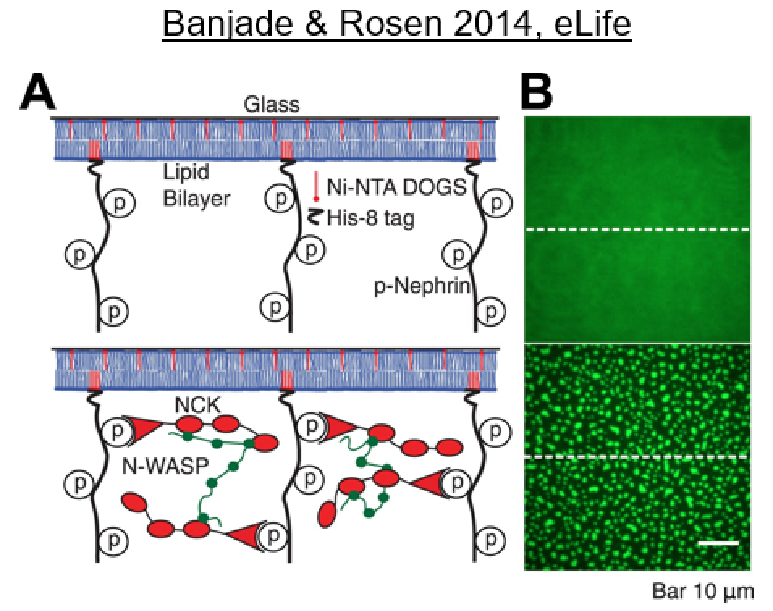

# SpringSaLaDpy: Biophysical Motivation

[Biomolecular condensates](https://www.ncbi.nlm.nih.gov/pmc/articles/PMC7434221/) are membrane-less sub-cellular compartments that play an important role in spatiotemporal regulation of cellular biochemistry. Clustering of weakly interacting multivalent biomolecules (proteins and nucleic acids) leads to condensate formation via phase transition ( [Li 2012](https://www.ncbi.nlm.nih.gov/pmc/articles/PMC3343696/), [Hyman 2014](https://www.annualreviews.org/doi/full/10.1146/annurev-cellbio-100913-013325), [Choi 2020](https://www.annualreviews.org/doi/full/10.1146/annurev-biophys-121219-081629)). Dysregulation of condensate biology is implicated in a series of pathological conditions ([Alberti 2019](https://www.annualreviews.org/doi/10.1146/annurev-genet-112618-043527?url_ver=Z39.88-2003&rfr_id=ori%3Arid%3Acrossref.org&rfr_dat=cr_pub++0pubmed), [Mathieu 2020](https://pubmed.ncbi.nlm.nih.gov/33004511/), [Wang 2021](https://www.nature.com/articles/s41392-021-00678-1)).

Since clustering of multivalent biomolecules underlies the condensate formation, characterizing the physical properties of these clusters has become a major aspect in recent biophysical research. For example, size and composition of the condensates have important consequences in cell signaling ([Su 2016](https://pubmed.ncbi.nlm.nih.gov/27056844/), [Case 2019](https://pubmed.ncbi.nlm.nih.gov/30846599/)). 

One well-characterized multivalent system is Nephrin, Nck and NWASP ([Li 2012](https://www.ncbi.nlm.nih.gov/pmc/articles/PMC3343696/), [Banjade 2014](https://elifesciences.org/articles/04123)), which form large molecular complexes both in-vitro and in-vivo. 

Using SpringSaLaDpy, we demonstrate the essential aspects of biomolecular clustering: the cluster size distributions, distance from the membrane, cluster size and radius of gyration over time, etc. 

<table>
  <tr>
    <td></td>
    <td></td>
  </tr>
    <tr>
    <td></td>    
    <td></td>
  </tr>
 </table>

